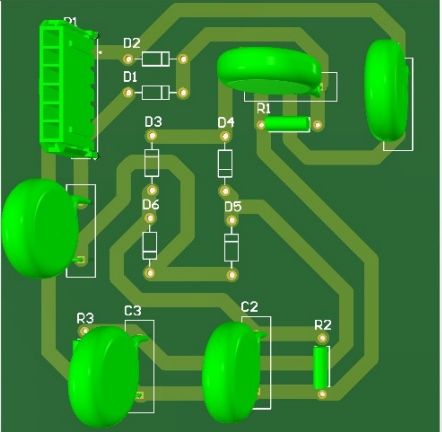
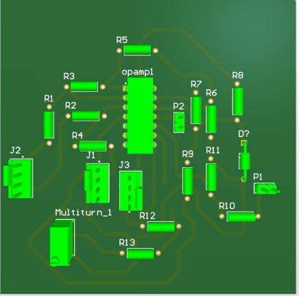
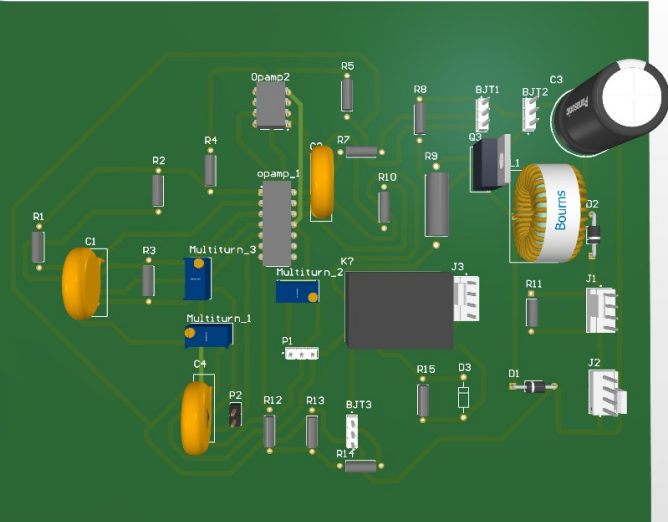

# Multistage Lead-Acid-Battery-Charger

## introduction

Lead acid batteries, among the earliest rechargeable battery technologies, derive their strength from the incorporation of elements such as antimony, calcium, tin, selenium, and the fundamental constituents of lead and acid. These batteries predominantly fall into two categories: starter batteries and recycle batteries. Charging these lead-acid batteries necessitates the use of diverse methodologies, including constant current chargers (CC), constant voltage chargers (CV), and the advanced multistage chargers.

Our project undertakes the development of a sophisticated multistage charger, engineered to seamlessly transition into constant voltage mode upon reaching a predefined battery voltage threshold. This innovative charger amalgamates the attributes of both CC and CV charging techniques to optimize battery longevity and performance.

Furthermore, our charger harnesses the precision of Pulse Width Modulation (PWM) to govern the charging process. It expertly converts a 230V power source into a stable 15V DC output, chosen deliberately to expedite the charging reaction without compromising safety. This synergy of elements and techniques culminates in a 12V lead acid battery charger, purpose-built to deliver a maximum current of 1A, all the while adhering to the CC-CV charging approach rooted in the PWM technique.

## Methodology
### Constant Current Stage
In the initial phase of charging the charger applies a fixed voltage to the battery terminals. However, the current delivered to the battery is controlled using PWM. The charger's control circuit monitors the current flows to the battery and adjusts the duty cycle of the PWM signal to maintain a constant current level at 1A. The PWM duty cycle will be adjusted to keep the current at this specified level.

### Transition to Constant Voltage Stage
As the battery charges and its voltage gradually increases, it eventually reaches a predetermined voltage level, often around 13.3V for a 12V lead acid battery. At this point, the charger switches from the constant current mode to the constant voltage mode. 

### PWM Control for Voltage
For this stage we have implemented a constant voltage contro circuit which monitors the constant (13.3V) voltage across the battery terminals and adjust the duty cicle of the PWM signal to maintain a constant voltage across the battery. If the battery voltage starts to exceed the desired voltage (e.g., 13.3V), the charger reduces the duty cycle of the PWM signal, effectively reducing the average voltage delivered to the battery. Conversely, if the battery voltage drops below the desired level, the duty cycle is increased to boost the voltage. This is crusial for maintain a healthy battery charging process.

### PCD designs

    
    
    

